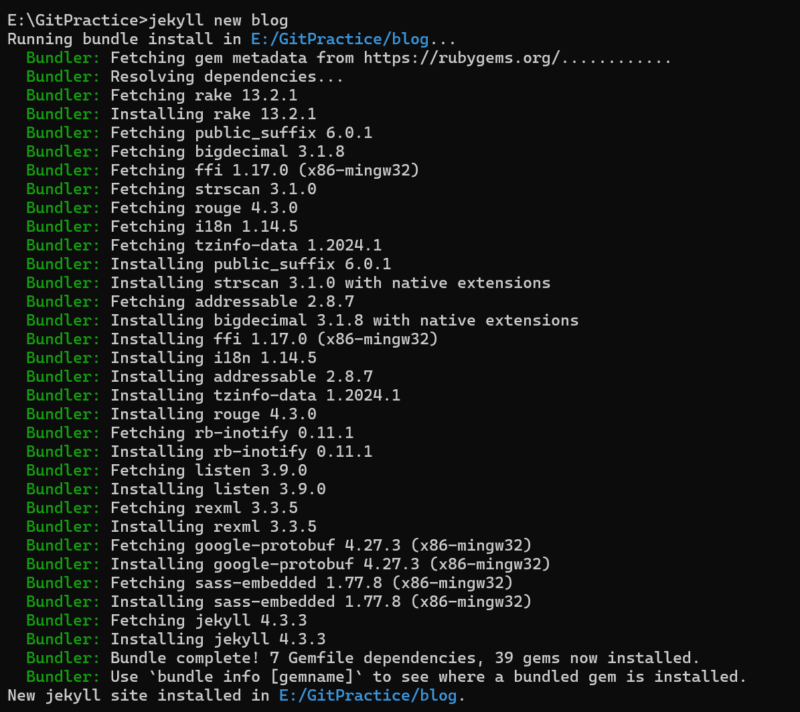

1. 깃허브 리포지토리 생성
- 예) yourusername.github.io
- Settings -> Pages -> Github Pages

2. 지킬 설치
- Ruby와 RubyGems를 설치
- 루비 명령어로 지킬과 bundler를 설치함.
- gem install jekyll bundler

3. 지킬 페이지 생성
- jekyll new [폴더이름]
- 
    - 설치 완료
- _config.yml에 들어가보면 기본 테마인 minima가 적용된걸 볼 수 있음.
```
// 디렉토리 구조
┌─ blog
├─ _posts
│  └─ 2024-08-16-welcome-to-jekyll.markdown
├─ .gitignore
├─ _config.yml
├─ Gemfile
...
```

4. 로컬에서 지킬 페이지 열기
- 지킬 서버를 로컬에서 실행한다.
    - 명령어: bundle exec jekyll serve
- 로컬 서버로 접속
    - http://localhost:4000
- 여기까지 성공하면 이제 로컬에서 지킬 페이지를 열고 커스텀할 수 있다.😊