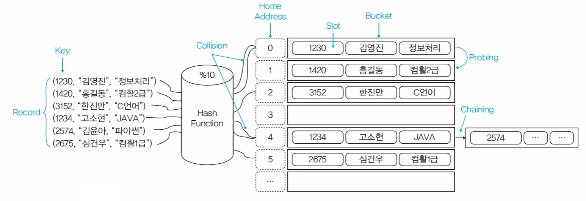

# 탐색 (Search)
> 출제빈도: 중  
> 빈출태그: 탐색의 종류, 시간 복잡도

## 탐색의 정의
* 데이터를 찾는 작업
* 내부 탐색과 외부 탐색으로 구분
  - 내부 탐색: 주기억장치 사용, 적은 양을 빠르게 탐색
  - 외부 탐색: 보조기억장치 함께 사용, 많은 양을 느리게 탐색

## 탐색의 유형 ⭐
1. 선형 탐색: 순차적으로 비교
2. 이분 탐색: 절반씩 나눠가며 탐색
3. 보간 탐색: 찾을 값의 위치값을 예상해서 검색하는 사전식 탐색
4. 블록 탐색: 대량의 데이터를 그룹별로 블록화, 인덱싱을 통해 탐색
5. 이진 트리 탐색: 검색 대상 데이터를 이진 트리로 변형한 뒤 탐색
6. 해싱 탐색: 해싱 함수를 사용해서 데이터를 검색

## 복잡도

### 공간 복잡도
* 사용되는 메모리의 크기
* 알고리즘의 품질에 영향을 미치는 비중이 낮음
* 메모리 용량과 관련됨

### 시간 복잡도
* 연산이 수행되는 횟수
* 환경에 따라 실행시간이 달라짐. 횟수가 정확한 기준이 됨
* 모든 연산이 다 반영되지는 않아서 정확하지 않지만 대략적인 횟수 산출
* 최악의 경우를 기준으로 산출
* 빅 오 표기법을 사용함

### 빅 오(O) 표기법
* **O(1)**: 일정한 수행 횟수를 가짐. 데이터의 개수와 상관없이 고정된 횟수로 실행
* **O(logN)**: 입력 데이터 수에 따라 연산 횟수가 늘어나는 폭이 점점 줄어듦. 이분탐색, 이진 트리 탐색에 이용
* **O(N)**: 연산횟수가 일정하게 증가(비례). 수열 계산이나 순차 탐색에 활용
* **O(NlogN)**: 입력 데이터 수에 따라 횟수가 늘어나는게 점점 커짐. 퀵 정렬, 힙 정렬, 병합 정렬에 사용
* **O(N²)**: 데이터 수에 따라 연산 횟수가 데이터 수의 제곱만큼 필요. 버블 정렬, 선택 정렬에 사용
* **O(2^N)**: 연산 횟수가 데이터 수의 지수승만큼 필요. 피보나치 수열 등의 재귀호출
* **O(N!)**: 가장 느린 알고리즘. 연산 횟수가 입력 데이터 수의 팩토리얼

## 주요 탐색 알고리즘

### 선형 탐색
* 순차적으로 비교
* 데이터의 개수나 정렬 여부를 알지 못해도 사용 가능
* 단순비교, 데이터 수가 적을 때 활용
* 시간복잡도: O(N)
* 비교 횟수 평균: (N+1)/2
* 예시: 5개의 데이터 중 22를 탐색하는 경우
  - 22가 1번째일 때: 1회 비교
  - 22가 3번째일 때: 3회 비교
  - 22가 N번째일 때: N회 비교

### 이분(Binary) 탐색
* 나눠진 데이터 그룹 중 대소 비교를 통해 다시 절반으로 나눔
* 데이터 개수 파악, 데이터 정렬 필요
* 중간으로 잘라서 중간값과의 대소 비교로 탐색
* 시작, 중간, 끝값 사용
* 시작 위치가 끝 위치보다 커지면 탐색 종료

### 해시(Hash) 탐색
* 해시 함수를 사용
* 시간복잡도: O(1)
* 함수를 통해 저장 위치가 충돌할 경우 조치 필요

#### 주요 용어
* **홈 주소**: 해시 테이블 내부 인덱스
* **키**: 해싱 함수의 입력값이 되는 데이터
* **버킷**: 슬롯들의 집합. 홈 주소에 여러 버킷 존재 가능
* **슬롯**: 하나의 데이터를 저장할 수 있는 공간
* **해시 테이블**: 다수의 홈 주소와 버킷으로 구성된 기억 공간
* **동의어(Synonym)**: 충돌이 일어난 슬롯의 집합
* **충돌(Collision)**: 서로 다른 슬롯이 같은 키를 가지는 현상
* **프로빙(Probing)**: 충돌 발생 시 다음 공간으로 이동
* **체인법(Chaining)**: 연결 리스트 형태로 같은 홈 주소 내에서 슬롯을 이어서 오버플로우 해결

### 해시 함수의 종류 ⭐
1. **제산법(Division)**: 나눈 나머지값을 이용해 저장위치 결정
2. **폴딩법(Folding)**: 부분별 숫자의 합연산, XOR 연산의 결과로 저장 위치 결정
3. **제곱법(Square)**: 제곱한 결과의 일부분으로 저장 위치 결정
4. **숫자 분석법(Digit Analysis)**: 숫자 분포가 고른 부분을 분석하여 저장위치 결정
5. **기수 변환법(Radix Conversion)**: 키값을 다른 진법으로 변환하여 저장 위치 결정
6. **무작위법(Random)**: 난수를 이용

### 해시 함수의 조건
* 충돌을 최소화할 수 있어야 함
* 복잡하지 않고 빠르게 처리될 수 있어야 함