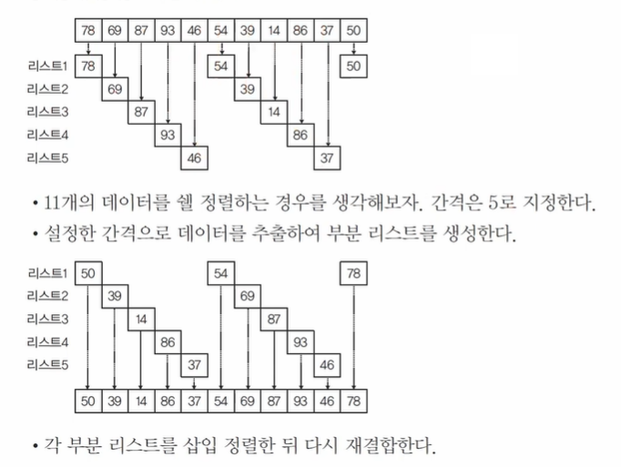
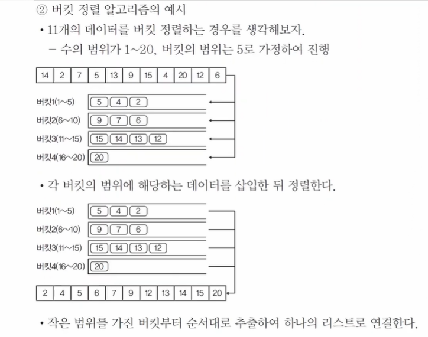

# 정렬 (Sorting)
> 출제빈도: 중  
> 빈출 태그: 선택 정렬, 버블 정렬, 삽입 정렬

## 정렬의 기본 개념
* 순서대로 나열하는 방법
* **오름차순(Ascending)**: 순서대로
* **내림차순(Descending)**: 역순으로

## 정렬의 시간복잡도 ⭐

| 정렬 방식 | 평균 | 최악 |
|-----------|------|------|
| 삽입 정렬 | O(N²) | O(N²) |
| 버블 정렬 | O(N²) | O(N²) |
| 선택 정렬 | O(N²) | O(N²) |
| 쉘 정렬 | O(N^1.5) | O(N^1.5) |
| 힙 정렬 | O(NlogN) | O(NlogN) |
| 이진 병합 정렬 | O(NlogN) | O(NlogN) |
| 퀵 정렬 | O(NlogN) | O(N²) |
| 버킷 정렬 | O(D+N) | O(N²) |

## 정렬 알고리즘 상세

### 선택 정렬
* 기준값(Key)으로 선택된 데이터를 나머지 데이터와 비교
* 선택된 데이터와 나머지 데이터의 최소값을 비교
* 처리 방식:
  - 선택 데이터 > 최소값: 치환
  - 선택 데이터 < 최소값: 유지
* 특징:
  - 첫 데이터 공간에 가장 작은 데이터가 존재하게 됨
  - 나머지 공간을 정렬 대상으로 재지정
  - 비교가 시작되는 위치가 증가

### 버블 정렬
* 기준값으로 지정한 데이터와 다음(오른쪽) 데이터와 비교
* 처리 방식:
  - 기준값 > 오른쪽 데이터: 치환
  - 기준값 < 오른쪽 데이터: 유지
* 특징:
  - 마지막 위치에 가장 큰 데이터가 존재
  - 종료 위치가 감소됨

### 삽입 정렬
* 좌측에 정렬된 요소와 비교해서 삽입
* 처리 방식:
  - 좌측 데이터와 비교
  - 두 번째 데이터부터 정렬을 진행
  - 기준값보다 큰 데이터가 있으면 큰 데이터 중 가장 작은 데이터의 위치에 기준값을 삽입
* 특징:
  - 비교 범위가 점점 커짐

### 쉘(Shell) 정렬

* 삽입 정렬의 단점을 보완한 정렬 방식
* 특징:
  - 많은 데이터의 이동이 필요한 삽입 정렬의 단점을 보완
  - 데이터들의 간격을 정하고 간격을 점차 줄여가며 삽입 정렬을 진행
  - 다수의 부분 리스트를 생성하여 삽입 정렬을 진행

### 힙(Heap) 정렬
* 완전 이진 트리 형태로 만들어 정렬하는 방식
* 처리 과정:
  1. 자식 노드가 부모 노드보다 큰 경우 자료를 교환(하향식 힙)
  2. 정렬 대상을 하향식 힙으로 생성
  3. 생성된 힙에서 최대 노드를 추출, 삭제하면서 배열에 끝에서부터 나열
  4. 마지막 노드를 첫 노드의 자리로 이동
  5. 변경된 힙은 하향식 조건에 따라 다시 구조화
  6. 힙 노드가 2개 남을 때까지 반복

### 이진 병합 정렬
* 두 데이터를 한 쌍으로 병합 정렬
* 정렬된 두 그룹을 한 쌍으로 정렬 반복

### 버킷 정렬

* 작은 버킷을 만들고 정렬을 마친 뒤 다시 합침
* 특징:
  - 데이터 범위를 균등하게 나눔
  - 데이터 범위 파악이 가능해야 함
  - 스택을 이용함

### 퀵(Quick) 정렬
* 분할 정복 알고리즘을 적용한 빠른 시간복잡도의 정렬
* 처리 단계:
  1. **분할(Divide)**: 기준값(pivot)을 기준으로 큰 값은 오른쪽, 작은 값은 왼쪽의 부분 배열로 분할
  2. **정복(Conquer)**: 부분 배열을 다시 분할, 적절한 크기가 되면 정렬
  3. **결합(Combine)**: 배열들을 하나로 결합
* 특징:
  - 많은 자료 이동을 없애고 순환 호출로 정렬을 반복
  - 기준값은 이미 정렬되었다고 판단