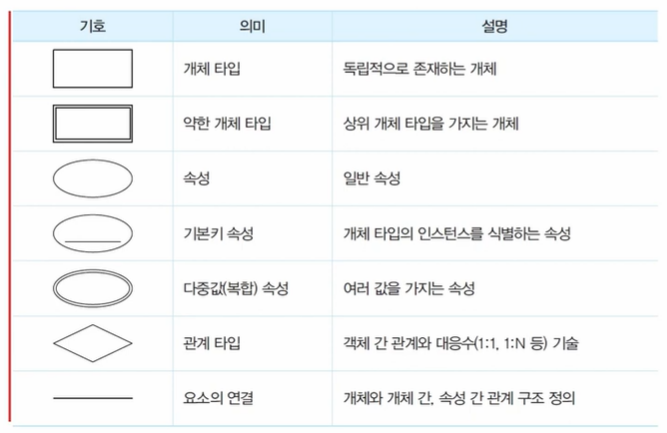
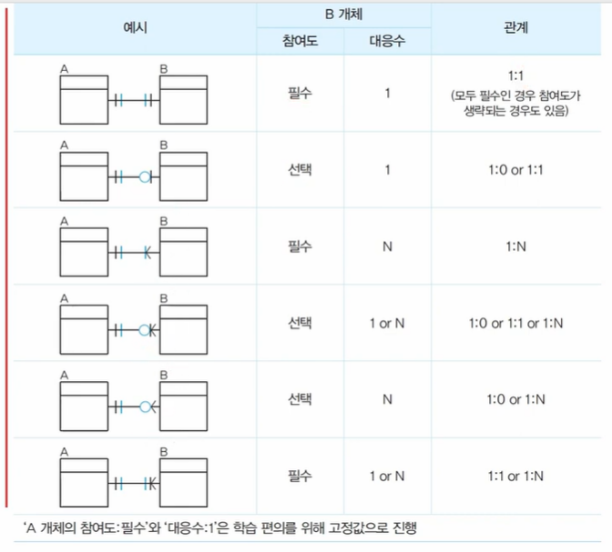
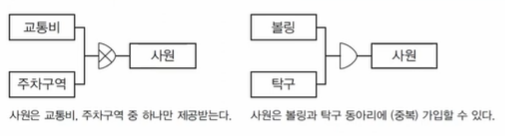

# 논리 E-R 다이어그램과 ERD

> 출제 빈도: 하  
> 빈출 태그: ERD, 표기법, 확장 ERD

## 1. E-R 다이어그램 (ERD)

### 1.1 정의와 특징
- 개체와 개체간 관계를 미리 약속된 도형을 사용해서 표현한 도표
- 개념, 논리 데이터 모델링에서 많이 사용됨
- 특정 시스템 환경을 고려하지 않음
- 업무 영역이 변경된 경우 설계 변경이 발생할 수 있음

### 1.2 구성요소
- 개체
- 관계
- 속성

## 2. ERD 표기법

### 2.1 피터-첸 표기법
- ⭐ **가장 중요!** ⭐
- 학습과 시험에 가장 많이 사용됨
- 단순한 도형으로 표기

### 2.2 정보 공학 표기법 (IE/Crow's Foot 표기법)
- 개체 타입에 포함되는 모든 속성을 하나의 그룹으로 표현
- 관계형 데이터베이스에 최적화됨
- **대응수**
  - 1:1
  - 1:N
  - N:M
- **참여도**
  - 필수
  - 선택

## 3. 확장 E-R 다이어그램

### 3.1 정의
재사용, 상속, 확장성 개념을 적용하여 현실세계를 보다 정확하게 표현

### 3.2 주요 개념
- 슈퍼/서브 타입
- 특수화/일반화
- 상속
- 집단화
- 분류화

### 3.3 서브 타입 (Sub Type)
- 상위 개체 타입이 다수의 하위 개체 타입과 관계를 가짐
- **배타적(Exclusive) 서브타입**: 서브타입 중 하나와 통합
- **포괄적(Inclusive) 서브 타입**: 서브타입 중 하나 또는 다수와 통합

### 3.4 일반화와 구체화
- **일반화(Generalization)**
  - 다수의 하위 개체 타입을 부분 집합으로 표현하는 방식
  - 상향식 설계 방식
  - 상위 개념으로 올라갈수록 일반화

- **구체화(Specialization)**
  - 개체 타입을 다수의 하위 개체 타입으로 분리
  - 하향식 설계 방식
  - 하위 개념으로 내려갈수록 구체화
  - "하위 개체 is a 상위 개체" 관계

### 3.5 집단화와 분해화
- **집단화(Aggregation)**
  - 관련 있는 개체 타입을 생성

- **분해화(Decomposition)**
  - 개체의 결합으로 이루어진 개체를 하나하나 분리
  - "부품 개체 is part of 결합 개체" 관계

### 3.6 분류화와 인스턴스화
- **분류화(Classification)**
  - 특정 유형을 공통적으로 가지는 하위 개체를 묶어서 하나의 상위 개체로 정의
  - "하위 개체 is member of 상위 개체" 관계

- **인스턴스화(Instantiation)**
  - 한 개체의 특성을 기본으로 하는 여러 형태의 개체를 생성
  - 업무 유형에 따라 여러 가지로 분류 가능
  - 상속 관계가 아님

> **Note**: 시나리오를 통한 다이어그램 요소 추출은 실제 예시와 함께 학습하는 것이 효과적입니다.