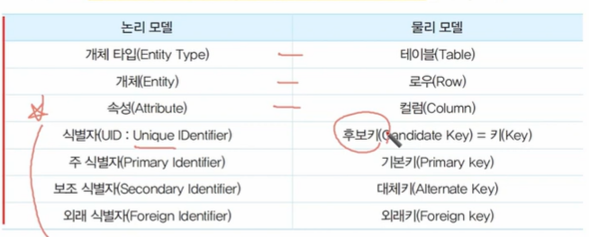
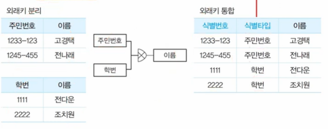

# 물리 DB 모델링 완벽 가이드

> 출제 빈도: 중  
> 빈출 태그: 타입 변환, 시스템 카탈로그, 반정규화

## 물리 데이터 모델 변환

### 개체를 테이블로 변환

* 후보키가 고유 Index 개념을 보유

### 타입 변환 방식

#### 1. 슈퍼 타입 기준 변환
* 서브 타입을 슈퍼 타입에 통합하여 단일 테이블로 변환
* 서브 타입에 많은 속성이나 관계가 있는 경우 적절

**단일 테이블 통합의 장점**:
* 데이터 액세스 용이
* 뷰를 통한 서브타입 액세스/수정 가능
* 수행속도 향상
* 임의 집합 가공 용이
* 조인 감소
* SQL 통합 처리 용이

#### 2. 서브 타입 기준 변환
* 서브타입별로 개별 테이블 생성
* 서브타입에 많은 속성/관계가 있는 경우 적절

**유리한 경우**:
* 서브 타입 속성들의 선택사양이 명확할 때
* 구분 처리가 불필요할 때
* 전체 테이블 스캔 시
* 단위 테이블 크기 감소 필요 시

#### 3. 개별 타입 기준 변환
* 슈퍼/서브 타입을 각각 독립 테이블로 변환

**적용 상황**:
* 전체 데이터 처리가 빈번할 때
* 서브타입 처리가 독립적일 때
* 통합 테이블의 컬럼 수가 과다할 때
* 서브타입 컬럼 수가 많을 때
* 슈퍼타입 중심의 트랜잭션 발생 시
* 슈퍼타입에서 광범위한 처리가 빈번할 때

### 관계 변환
* **1:M 변환**: 가장 일반적인 관계 형태
* **1:1 변환**: 자주 사용되는 테이블이 외래키 보유
* **1:M 순환 관계**: 자체 참조 외래키 추가로 계층 구조 표현

### 배타적 관계 변환
* 외래키의 분리/결합을 통한 변환
* **외래키 분리**: 관계별 컬럼 생성
* **외래키 결합**: 관계들을 단일 컬럼으로 통합 (타입 구분 컬럼 필요)

> 주민번호와 학번을 하나로 쓰고 어떤 타입의 데이터인지 별도로 접근하는 방법

## 컬럼 변환과 데이터 표준

### 컬럼 변환
* **관리 목적 컬럼 추가**: 업무 수행 속도 향상을 위한 정보 추가
* **데이터 타입 선택**: DBMS 특성 고려한 최적 타입 선택

### 데이터 표준 적용
**명명규칙**:
1. 시스템 카탈로그(데이터 사전)를 통한 파악
2. 한글명과 동일 용어의 영문 변환
3. 표준 영문약어 참고
4. 명명순서:
   * 업무영역
   * (주제어)수식어
   * 주제어
   * (분류어)수식어
   * 분류어
   * 접미사

## 데이터베이스 반정규화

### 기본 개념
* **정의**: 시스템 운영 단순화를 위한 중복/통합/분할 수행
* **특징**: 일관성/안정성 증가, 성능 저하

### 필요한 상황
* 처리 속도 저하 시
* 특정 범위 데이터의 빈번한 처리 필요 시
* 집계 정보가 자주 요구되는 경우

### 반정규화 유형

#### 1. 중복 테이블 추가
* 빈번한 처리나 대용량 데이터 처리 시 적용

#### 2. 테이블 조합
* 다수 테이블 연계 처리가 주된 경우

#### 3. 테이블 분할
* **수직분할**: 컬럼 사용빈도 기준
* **수평분할**: 데이터 사용빈도 기준

#### 4. 테이블 제거
* 유지보수 단계에서 발생
* 관리 소홀이 주요 원인

#### 5. 컬럼의 중복화
* 자주 사용되는 컬럼이 다른 테이블에 분산된 경우
* 다른 해결방법 우선 검토
* 무결성 유지에 주의