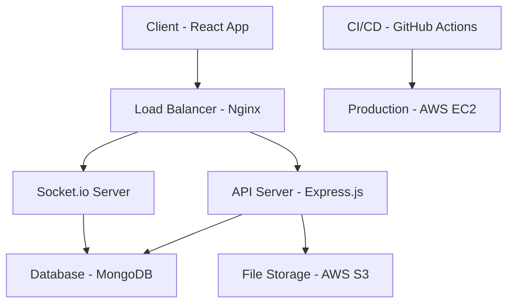

# 🚀 풀스택 웹 애플리케이션

## 📋 프로젝트 개요

이 프로젝트는 모던 웹 개발 기술을 활용하여 구축한 완전한 풀스택 웹 애플리케이션입니다. 사용자 친화적인 인터페이스와 강력한 백엔드 시스템을 통해 실용적인 웹 서비스를 제공합니다.

## ✨ 주요 기능

### 🔐 인증 시스템
- JWT 기반 사용자 인증
- 소셜 로그인 (Google, GitHub)
- 비밀번호 암호화 및 보안
- 이메일 인증 및 비밀번호 재설정

### 💬 실시간 채팅
- Socket.io를 활용한 실시간 메시징
- 그룹 채팅 및 개인 채팅
- 파일 첨부 및 이미지 공유
- 온라인 사용자 상태 표시

### 📁 파일 관리
- 드래그 앤 드롭 파일 업로드
- 이미지 리사이징 및 최적화
- 클라우드 스토리지 연동 (AWS S3)
- 파일 타입 검증 및 보안

### 📊 대시보드
- 사용자 활동 통계
- 실시간 데이터 시각화
- 반응형 차트 및 그래프
- 커스터마이징 가능한 위젯

## 🛠 기술 스택

### Frontend
- **React 18**: 컴포넌트 기반 UI 라이브러리
- **TypeScript**: 타입 안정성 및 개발 효율성
- **Tailwind CSS**: 유틸리티 중심의 CSS 프레임워크
- **React Router**: 클라이언트 사이드 라우팅
- **Axios**: HTTP 클라이언트
- **Socket.io Client**: 실시간 통신

### Backend
- **Node.js**: JavaScript 런타임
- **Express.js**: 웹 프레임워크
- **TypeScript**: 서버 사이드 타입 지원
- **MongoDB**: NoSQL 데이터베이스
- **Mongoose**: MongoDB ODM
- **Socket.io**: 실시간 통신 서버
- **JWT**: 인증 토큰
- **Bcrypt**: 비밀번호 해싱

### DevOps & Tools
- **Docker**: 컨테이너화
- **Docker Compose**: 다중 컨테이너 관리
- **GitHub Actions**: CI/CD 파이프라인
- **AWS EC2**: 클라우드 호스팅
- **AWS S3**: 파일 스토리지
- **Nginx**: 리버스 프록시

## 🏗 아키텍처

